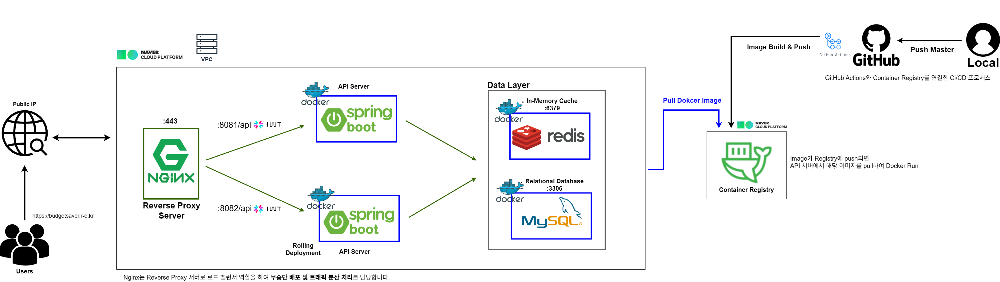
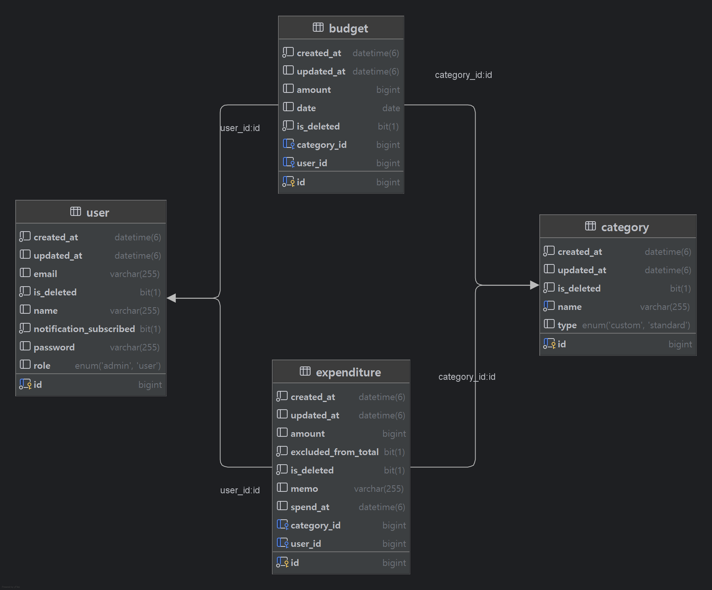
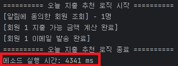
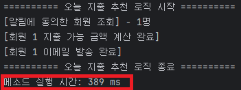

 # <예산 관리 어플리케이션  *Budget Saver*> 

- 개인 재무를 관리하고 지출을 추적하는데 도움을 주는 어플리케이션 
- 예산을 설정하고 지출을 모니터링하며 재무 목표 달성에 도움을 줄 수 있는 서비스입니다.
<hr>

### 프로젝트 기간
2025.11.01 ~ 2025.12.15 (1.5개월)
### 개발 인원
개인 프로젝트 - BE(1명)
### 목차
- [요구사항 정리](#요구사항-정리)
- [기술 스택](#-tech-stack)
- [시스템 아키텍처](#시스템-아키텍처)
- [ERD](#ERD)
- [핵심 구현 기술과 최적화 포인트](#핵심-구현-기술과-최적화-포인트)
    - [🚀 **부하 테스트**를 통한 성능 분석 및 개선(with. **Caching**)](#-부하-테스트--캐싱-기반-성능-개선-예산-추천-api)
    - [⚡ Indexing을 통한 성능 개선 (to. 지출 목록 조회)](#-indexing을-통한-성능-개선-to-지출-목록-조회)
    - [💡 예산 추천 알고리즘 구현(with. **Strategy Pattern**)](#-예산-추천-기능--전략-패턴-적용)
    - [📧 알림 발송 **Event** 처리 (with. **비동기 처리**)](#-알림-발송-기능--Spring-Event-기반-구조)
    - [💼**Spring Security + Jwt** 인증/인가 구현](#-Spring-Security--Jwt-인증인가)
- [테스트 코드 작성](#테스트-코드-작성)
    - [🔐 **@WithMockUser를 커스텀**하여 SecurityContext 세팅](#-WithMockUser-커스텀--CurrentUser-테스트)
    - [🐳 TestContainer + Repository 테스트](#-Testcontainers-기반-Repository-테스트)
    - [⏱️ Test 병렬 실행으로 실행 시간 단축](#-Test-병렬-실행으로-실행-시간-단축)
- [배포](#배포)
    - [🤖 **Docker Compose + GitHub Actions** 기반 CI/CD 구축](#-Docker-Compose--GitHub-Actions-기반-CICD-구축)
<hr>

## 📖 요구사항 정리
> 요구사항에 대한 내용은 아래 링크를 통해 확인 하실 수 있습니다.
>- [요구사항 링크](https://www.notion.so/2a3f28c9b355807c9021eacefac39640)

## 🛠️ Tech Stack

| Category                          | Technologies                                                                                                                                                  |
|-----------------------------------|---------------------------------------------------------------------------------------------------------------------------------------------------------------|
| **Backend & ORM**                 |                                                                 |
| **Database & Cache**              |   |
| **Containerization & CI/CD**           |                                                                              |
| **Reverse Proxy & Load Balancer** |                                                                                 |
| **Load Testing**                  |                                                                          |
| **Hosting**                       |                                                            |
<hr>

## 📌시스템 아키텍처


<hr>

## ⚙️ERD

<hr>

## 핵심 구현 기술과 최적화 포인트

## 🚀 부하 테스트 + 캐싱 기반 성능 개선 (예산 추천 API)

예산 추천 API(`/api/budget/recommendation`)는  
사용자가 입력한 전체 예산을 기존 유저들의 **카테고리별 소비 평균 비율**로 분배해주는 기능이다.

초기 버전에서는 대량 데이터 집계(Group By)로 인해  
응답 지연 · TPS 저하가 발생해,  
**DB 튜닝 → 집계 테이블 적용 → 캐싱** 과정을 통해 성능을 단계적으로 개선했다.

### 1️⃣ V1 — 매 요청마다 전체 데이터 집계  

초기 버전에서는 요청이 들어올 때마다 `Budget` 테이블 전체를 조회해  
카테고리 합계 및 평균을 실시간으로 계산했다.

### 🔍 결과 문제점
- 평균 응답 시간 **13초 이상**  
- TPS **73.6**  
- 대량 동시 요청 시 **DB 병목 및 Connection Pool 부족** 발생  
→ *데이터가 늘어날수록 성능이 기하급수적으로 나빠짐*


### 2️⃣ V2 — 집계 테이블 도입으로 집계 비용 제거  

GROUP BY 비용을 제거하기 위해  
등록/수정/삭제 시점에 합계를 미리 계산해 저장하는  
**집계 테이블(total_budget)** 을 도입했다.

### 🔍 개선 효과  
- 응답 속도 및 TPS 대폭 개선 **(V1에 비해 TPS 23배 증가)**
- 조회 시 GROUP BY 제거 → DB 부하 감소  

### ⚠️ 한계  
- **테이블 증가로 인한 스키마 관리 비용 증가**
- **유연성 부족**: 다른 기준의 통계가 필요하면 테이블이 더 늘어남
- 실시간 집계 데이터가 필요 없는 API 특성상 더 최적화가 가능

### 3️⃣ V3 — Redis 캐싱 적용 (최종 구조)  

예산 추천 데이터는 실시간성이 낮다는 점에 착안해    
**TTL 기반 캐싱 전략**으로 조회 속도를 최적화했다.

| V1 구조 | V2 구조 | V3 구조 |
|---------|---------|---------|
|  |  |  |


### 🔍 개선 효과  
- DB 부하 대폭 감소  
→ 매 요청마다 집계 테이블(total_budget) 또는 원본 Budget 테이블을 조회할 필요가 없어짐.
- 평균 응답 시간 추가 단축  
→ 캐시에 적중하는 경우 DB I/O 없이 즉시 응답.
- TPS 증가 및 안정성 강화  
→ DB Connection Pool 의존도 낮아져 높은 Vuser 상황에도 안정적 처리 가능.
- 예산 변경 시 부가 로직 제거  
→ 캐시를 즉시 갱신하거나 정합성 유지 로직을 넣지 않아도 됨 → 유지보수 비용 감소.

## 🔍 최종 성능 지표 (V1 → V3)

| 항목 | V1 | V3 | 개선 폭 |
|------|------|------|---------|
| **TPS** | 73.6 | **1,895.1** | 약 25.7배 ↑ |
| **Peak TPS** | 87.5 | **2,205.5** | 약 25.2배 ↑ |
| **평균 응답 시간** | 13,264ms | **510ms** | 약 26배 ↓ |
| **오류율** | 0.0047% | **0.00053%** | 안정성 ↑ |

### 🔗 상세한 테스트 결과 & 분석 정리 링크
>- [부하 테스트 + 캐싱을 통한 성능 개선(with 예산 추천 API)](https://www.notion.so/with-API-2b1f28c9b355808594a8c501bf356104)
>- [부하 테스트 + 캐싱을 통한 성능 개선(with 카테고리 다건 조회 API)](https://www.notion.so/with-API-2b5f28c9b35580e2b544d76103ef95f5)

---

## ⚡ Indexing을 통한 성능 개선 (to. 지출 목록 조회)

### 🧩 문제 상황
지출 목록 조회는 사용자가 지정한 **기간**, **카테고리**, **지출 금액** 등의 조건을 기반으로 데이터를 검색한다.  
이 중 **기간 조건(spend_at BETWEEN ? AND ?)** 은 모든 요청에서 공통적으로 사용되며, 시간이 지날수록 테이블의 데이터가 누적되어 **범위 스캔 비용이 점점 증가**하게 된다.

특히 지출 내역은 사용자가 계속 추가하는 성격의 데이터이기 때문에,
- 특정 사용자(user_id)
- 특정 기간(spend_at range)

조합으로 조회하는 요청이 대부분이었다.

그럼에도 불구하고 기존 테이블에는 해당 패턴을 고려한 인덱스가 없어 조회 실행 시 **큰 범위의 레코드를 불필요하게 스캔하는 문제**가 있었다.  
이에 따라 조회 성능 저하가 발생할 가능성이 높아져 **DB 레벨에서 구조적인 개선이 필요**했다.

### 🛠️ 해결 전략: 조회 패턴 기반 복합 인덱싱 적용

조회 로그와 실제 쿼리 패턴을 분석한 결과, 다음 조건이 모든 요청에서 반복적으로 사용됨을 확인했다.

```sql
WHERE e.user_id = ?
  AND e.spend_at BETWEEN ? AND ?
  AND c.is_deleted = 0;
```
### 🔎 주요 분석 결과

지출 목록 조회 쿼리를 분석한 결과, 다음 특징이 명확하게 나타났다.

- **user_id + spend_at 조합이 모든 조회에서 공통적으로 사용됨**
- 조회 요청은 대부분 **특정 사용자**의 **특정 기간 범위**에 집중됨
- 카테고리/메모 등의 부가 조건은 요청마다 달라 **캐싱은 효과가 거의 없음**

이러한 패턴을 고려하면, 캐시보다 **DB 인덱스를 통한 검색 범위 축소가 가장 효과적인 방식**이었다.

이에 따라 다음 복합 인덱스를 적용했다: (user_id, spend_at)

### 💭 인덱스 설계 이유

- 먼저 **user_id 조건으로 전체 데이터 범위를 대폭 축소**하고  
- 그다음 **해당 사용자 데이터 내부에서 spend_at 범위만 탐색**할 수 있다.

이 방식은 현재 서비스의 조회 패턴과 일치하며,  
**범위 조회가 많은 구조에 최적화된 인덱스 형태**라고 생각 했다.

### 📊 성능 테스트 결과

더미 데이터를 생성해 인덱스 적용 전/후의 조회 속도를 비교했다.

| 구분 | 평균 조회 시간 |
| --- | --- |
| 인덱스 없음 | 약 45~50ms |
| 인덱스 적용 | 약 30~35ms |

초기 데이터량이 많지 않아 큰 폭의 개선은 아니었지만,

- **불필요한 범위 스캔이 사라지고 쿼리 플랜이 안정화됨**
- **데이터가 증가할수록 인덱스 효과가 누적될 구조**임을 확인할 수 있었다

현재 데이터 기준에서는 체감 차이가 크지 않지만, 앞으로 데이터가 누적되는 것을 고려하면
인덱스 설계의 효과를 크게 체감 할 수 있을 것이라 생각한다.

### 🔗 인덱싱통한 성능 개선 상세 페이지 링크
>- [Indexing을 통한 성능 개선(to. 지출 목록 조회)](https://www.notion.so/Indexing-to-2b8f28c9b35580758db5c0e1ed95abe2)
---

## 💡 예산 추천 기능 & 전략 패턴 적용

### 📝 기능 개요
- 사용자가 카테고리를 지정하지 않고 총 예산(예: 100만원)만 입력하면,  
  기존 사용자들의 평균 설정 비율을 기반으로 **카테고리별 예산을 자동 생성**.
- 예시: 식비 40%, 주거 30%, 기타 15% 등  
  → **총액에 맞춰 금액 자동 계산**.

### ⚠️ 문제 상황
- 추천 로직이 바뀔 때마다 기존 코드를 직접 수정해야 하는 구조
- 새로운 추천 방식 추가 시 코드 유지보수가 어려움

### 🛠️ 해결 전략: **전략 패턴(Strategy Pattern) 적용**
- **행위를 인터페이스로 추상화**하고, 구체적인 추천 로직을 전략 클래스로 분리
- **Context**를 통해 런타임에 전략 선택 및 실행
- 기존 코드 수정 없이 새로운 추천 전략 추가 가능

###  전략 패턴 적용 효과
- ✅ **OCP 준수**: 기존 코드에 영향 없이 로직 확장 가능
- ✅ **유연성 향상**: 필요 시 추천 방식 변경 용이
- ✅ **테스트 용이**: 각 전략 단위 테스트 가능
- ✅ **유지보수 효율 개선**: 추천 로직 변경 시 Context만 수정하면 됨

### 🔗 전략 패턴 적용 상세 페이지 링크
>- [예산 추천 알고리즘 구현(with. Strategy Pattern)](https://www.notion.so/with-Strategy-Pattern-2aff28c9b35580e89a4affb562511a73)
---

## 📧 알림 발송 기능 & Spring Event 기반 구조

### 📝 기능 개요
- 매일 특정 시간에 **“오늘 지출 추천”**, **“오늘 지출 안내”** 알림 발송
- 이메일, 카카오톡, Discord 등 다양한 플랫폼 지원 가능
- 핵심 로직과 알림 발송 로직을 명확히 분리하고자 함

### ⚠️ 문제 상황
- 지출 추천 계산(핵심 로직)과 알림 발송(부가 기능)이 결합되어 있을 경우:
  - 유지보수 어려움
  - 새로운 플랫폼 추가/변경 시 코드 수정 범위 증가
  - 외부 통신 실패 시 전체 프로세스 영향
  - 성능 저하 발생

### 🛠️ 해결 전략: **Spring Event 기반 Pub-Sub 구조**
- **Publisher**: 핵심 로직 수행 후 이벤트 발행
- **Listener(Subscriber)**: 이벤트를 받아 알림 발송 등 부가 처리 수행
- 핵심 로직과 알림 로직 완전히 분리 → OCP 준수 및 유지보수 효율 향상

### ♒ 성능 최적화: **비동기 처리**

| 동기 처리 시 | 비동기 처리 시 |
|--------------|----------------|
|  | 

- 알림 발송을 **@Async 기반 비동기 처리**로 수행
- 외부 통신 지연이 핵심 로직에 영향을 주지 않음
- 테스트 결과 약 **11배 성능 향상** (동기: ~4,300ms → 비동기: ~390ms)

### 🎯 적용 효과
- 핵심 로직은 지출 추천 계산만 담당
- 알림 발송은 별도 쓰레드에서 처리 → 실행 시간 단축
- 새로운 알림 플랫폼 추가 시 Listener만 구현하면 됨
- 유지보수 용이, 확장성 확보

### ➕ 추가 고려 사항
- 서버 사양에 맞춘 **보수적 쓰레드 풀 설정** 적용
- Event 기반 구조의 한계: 장애 시 재처리 어려움, 대규모 트래픽 처리 제한
- 향후 서비스 확장 시 MQ(Kafka, RabbitMQ) 도입 고려 가능

### 🔗 알림 발송 Event 처리 상세 페이지 링크
>- [알림 발송 Event 처리 (with 비동기 처리를 통한 성능 개선)](https://www.notion.so/Event-with-2bff28c9b35580999dd2fb5e46ec6b27)
---

## 🧑‍💼 **Spring Security + Jwt** 인증/인가
### 🗝️ 인증(Authentication) 시퀀스 다이어그램


### 🛡️ 인가(Authorization) 시퀀스 다이어그램


---

## 테스트 코드 작성

## 🔐 @WithMockUser 커스텀 & CurrentUser 테스트

Spring Security 환경에서 컨트롤러 테스트를 작성할 때, `@AuthenticationPrincipal` 또는 `SecurityContextHolder`를 통해 현재 로그인 사용자의 정보를 읽어오는 패턴이 자주 등장합니다.  

현재 프로젝트에서는 `@CurrentUser`를 사용하여 userId를 주입하는 경우가 있습니다.  
컨트롤러 테스트에서 `@CurrentUser`가 정상 동작하려면 **SecurityContext에 userId를 세팅**해야 합니다.

### 1️⃣ 문제

- 기본 `@WithMockUser`는 **권한(Role)**만 설정 가능
- **userId(Long)와 같은 커스텀 Principal**은 넣을 수 없음
- 컨트롤러 테스트에서 로그인한 사용자 정보를 깔끔하게 주입하기 어려움


### 2️⃣ 해결 전략: 커스텀 어노테이션 + SecurityContextFactory

- **@MockCustomUser** 어노테이션을 만들어, 테스트 시 userId와 role을 정의
- SecurityContextFactory를 구현하여 **커스텀 Principal(userId)**을 SecurityContext에 세팅
- 테스트에서 `@MockCustomUser`를 붙이면 userId가 자동으로 SecurityContext에 들어감


### 3️⃣ 사용 흐름

1. 테스트 메서드에 `@MockCustomUser` 적용
2. SecurityContextFactory가 실행되어 Principal(userId)과 권한 세팅
3. 컨트롤러 메서드의 `@CurrentUser Long userId` 자동 주입
4. MockMvc 요청 실행
5. 실제 로그인과 동일한 흐름으로 테스트 처리


### 4️⃣ 효과

- 컨트롤러 테스트에서 로그인 사용자 정보를 깔끔하게 주입 가능
- 테스트 코드 가독성 향상, 반복 제거
- 실제 인증 흐름과 동일하게 테스트 가능

### 🔗 @WithMockUser를 커스텀하여 SecurityContext 세팅 상세 페이지 링크
>- [@WithMockUser를 커스텀하여 SecurityContext 세팅하기](https://www.notion.so/WithMockUser-SecurityContext-2bbf28c9b355802b895be507ed7b0e6chttps://www.notion.so/WithMockUser-SecurityContext-2bbf28c9b355802b895be507ed7b0e6c)

---

## 🐳 Testcontainers 기반 Repository 테스트

Spring 프로젝트에서 Repository 테스트는 서비스 테스트와 달리 **실제 DB 환경**이 필요합니다.  
JPA/Hibernate 쿼리, QueryDSL, 조인, 인덱스 등은 **메모리 DB(H2)와 실제 DB가 다르게 동작**할 수 있기 때문입니다.

### 1️⃣ Repository 테스트 원칙

- **진짜 DB 환경에서 테스트**해야 올바른 결과를 얻을 수 있음
- 단순 조회/저장 기능 확인뿐 아니라, SQL 방언, 조건 조회, 조인, 인덱스 활용 등도 검증 가능

### 2️⃣ 테스트용 DB 필요 이유

- 프로덕션 DB를 그대로 사용하면 데이터가 섞이거나 꼬일 수 있음
- Repository 테스트는 **“언제 실행해도 같은 결과”**라는 불변성을 보장해야 함
- 따라서 **테스트용 DB 또는 컨테이너 기반 DB 환경**을 별도로 구성해야 함

### 3️⃣ Testcontainers를 사용한 이유

- 단순 Repository 테스트는 로컬 DB + 트랜잭션 롤백으로도 충분
- 하지만 **통합 테스트**에서는 롤백이 보장되지 않고, 테스트 데이터가 남거나 환경마다 결과가 달라질 수 있음

### Testcontainers 핵심 효과

1. 테스트 실행 전 Docker로 DB/Redis 등 의존성 자동 실행  
2. 테스트 종료 후 컨테이너 자동 종료 → 항상 깨끗한 테스트 환경  
3. 누구나 동일한 환경에서 동일한 테스트 결과 보장

### 4️⃣ Testcontainers 주요 구성 요소

- **@Testcontainers** : 테스트 클래스에서 Testcontainers 사용 선언  
- **@Container** : 테스트에 필요한 Docker 컨테이너 정의  
- **DynamicPropertySource** : 컨테이너 접속 정보를 Spring 환경 변수로 주입  
- **GenericContainer** : 공식 모듈 없는 서비스(Redis, Kafka 등) 실행 시 사용  

### 🔗 TestContainer 설정을 통한 Repository 테스트 상세 페이지 링크
>- [TestContainer 설정을 통한 Repository 테스트](https://www.notion.so/TestContainer-Repository-2bbf28c9b355806cb68ae68ea9f273df)

---

## ⏱️ Test 병렬 실행으로 실행 시간 단축

| 병렬 처리 전 | 병렬 처리 후 |
|--------------|----------------|
|  | 

기존 테스트는 순차적으로 실행되어, 이전 테스트가 끝나야 다음 테스트가 진행되었습니다.  
이를 병렬로 실행하도록 설정하여 **빌드 시간과 테스트 소요 시간을 단축**했습니다.

---

## 배포

## 🤖 Docker Compose + GitHub Actions 기반 CI/CD 구축

> 단일 EC2 환경에서 비용 최소화와 무중단 배포를 동시에 달성한 CI/CD 정리

### 🏗 아키텍처 개요

- **목표**: 저비용 환경에서 안정적 CI/CD 구현  
- **구성**:  
  - 단일 EC2에서 **Spring Boot 2대(App1/App2), Redis, MySQL, Nginx** 운영  
  - **Docker Compose**로 모든 서비스 컨테이너화 → 환경 일관성 확보  
  - **GitHub Actions**로 자동 빌드/배포  
  - **Rolling 방식**으로 무중단 배포  


### 🐳 Docker Compose 선택 이유

- 설치 부담 감소 → Java, MySQL, Redis 따로 설치 필요 없음  
- 환경 일관성 유지 → 개발·테스트·배포 모두 동일한 컨테이너 환경  
- 이미지 기반 배포 → EC2에 직접 설치할 필요 없이 최신 이미지 pull 후 실행  


### 🔄 무중단 배포 전략

### Blue-Green vs Rolling

| 구분 | Blue-Green | Rolling |
|------|------------|---------|
| 개념 | 서버 그룹 2세트 전체 교체 | 서버를 순차적으로 1개씩 교체 |
| 장점 | 빠른 전환, 안전한 롤백 | 비용 부담 없음, 단일 EC2 가능 |
| 단점 | 서버 수 2배 필요, 비용 증가 | 롤백 속도 느림, 교체 중 부하 발생 가능 |

- **선택 이유**: 단일 EC2 환경에서 **순차적 서버 교체**로 무중단 유지, 비용 최소화 가능

### 🩺 Health Check 중요성

- Docker Compose는 **실행 순서를 보장하지 않음**  
- MySQL/Redis가 완전히 준비되기 전 Spring 서버가 시작되면 연결 오류 발생 가능  
- Health Check를 통해 컨테이너 정상 상태 확인 후 서버 실행 → 안정적 배포

### ⚙️ GitHub Actions 기반 배포 흐름

1. **master 브랜치 push** → GitHub Actions 트리거  
2. **Docker 이미지 빌드 및 Push**  
3. **EC2 접속 후 배포 스크립트 실행**  
4. **Rolling 방식으로 App1 → App2 순차 교체**  
5. Nginx 트래픽 분산 및 유지 → 서비스 중단 없이 배포 완료

### ⭐ 핵심 포인트

- 모든 민감한 정보는 **환경 변수 + GitHub Secrets**로 관리  
- Redis/MySQL은 최초 배포 시 1회만 컨테이너 실행  
- Spring 서버만 순차 교체 → **무중단 배포 실현**  
- Docker Compose + GitHub Actions 조합으로 **저비용·안정성·자동화** 달성

### 🔗 Docker Compose 기반 CI/CD 구축 상세 페이지 링크
>- [Docker Compose 기반 CI/CD 구축](https://www.notion.so/Docker-Compose-CI-CD-2bbf28c9b3558091b7cbca6b463e9c34)
